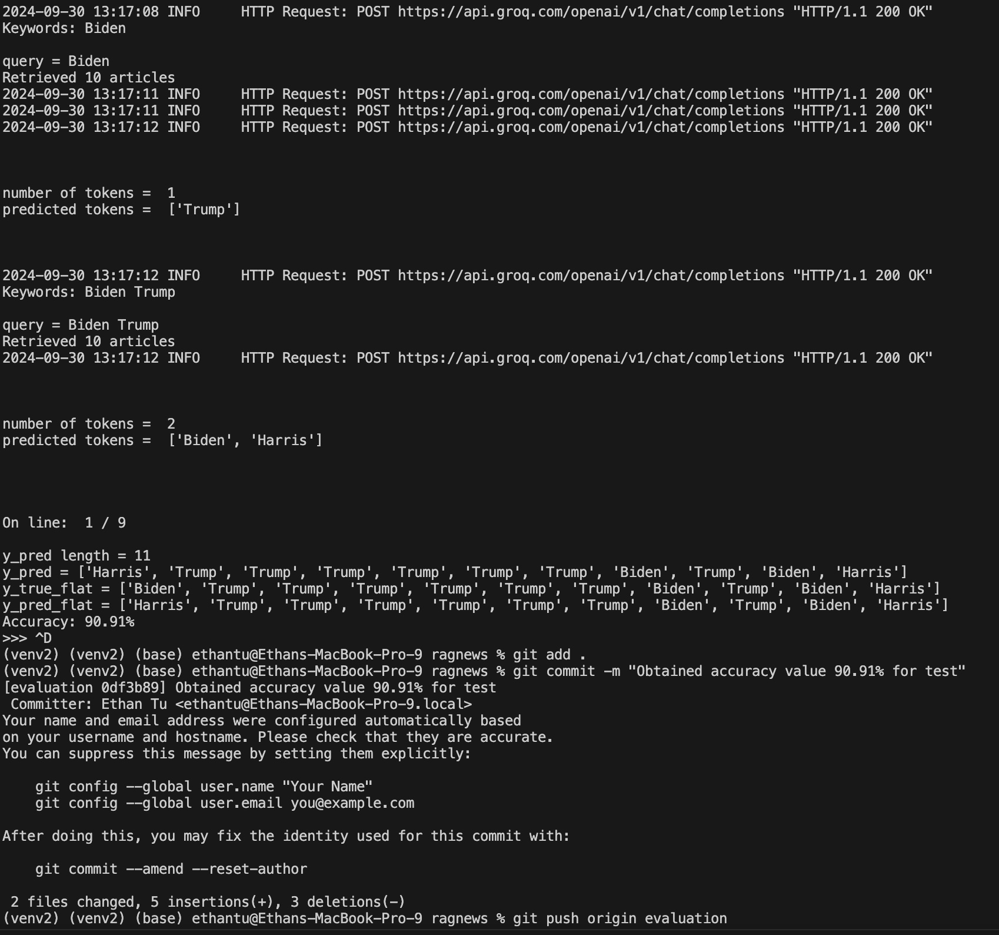

# RAGNews

## Overview

`ragnews` is a Python-based Question & Answer (Q&A) system that integrates with the Groq API and leverages Retrieval-Augmented Generation (RAG). This system retrieves relevant news articles from a user-provided database to generate accurate, real-time responses to user queries. RAGNews is designed for users looking to enhance the capabilities of Groq models by pulling from up-to-date news sources.

## Key Features

- Retrieval-Augmented Generation (RAG): Efficiently fetches relevant articles to improve response accuracy.
- News Integration: Processes user queries using a dynamic database of news articles.
- Groq API Powered: Leverages Groq models for natural language processing.

## RAGNews Evaluation Branch

In this branch, we create an evaluator python file to calculate an accuracy percentage for our `ragnews.py`. We do this by utilizing masked tokens and asking the model to predict which politician matches the context of the sentence. The number of correct predictions over the true token values is our accuracy percentage. 

## The Objective

We were tasked with adjusting all of the "hyperparameters" so that evaluate.py gives at least 70% accuracy on the file hairy-trumpet/data/wiki__page=2024_United_States_presidential_election,recursive_depth=0__dpsize=paragraph,transformations=[canonicalize, group, rmtitles, split].

Here is a screenshot documenting my accuracy score:




## Getting Started

# Prerequisites

Before proceeding, check that you have the following installed:

- Python 3.8 or 3.9
- A Groq API key (instructions below)

# Installation

To get started with `ragnews`, follow these steps to set up your
development environment and run the application:

1. **Clone the repository:**
```
$ git clone https://github.com/EthanTu2/ragnews.git
$ cd ragnews
```

2. **Create a virtual environment:**

```
$ python3.9 -m venv venv
$ source venv/bin/activate
```

3. **Install the necessary Python packages:**

```
$ pip3 install -r requirements.txt
```

4. **Set up a GROQ API key:**
    - Create an API key at https://groq.com/
    - Create a `.env` file in the project root directory and add your Groq API key.
    
    ```
    GROQ_API_KEY=your_api_key_here
    ```

    - Export the environmental variables:

        ```
        $ export $(cat .env)
        ```

## Running the Application
Once your environment is set up, you can start RAGNews:
```
$ python3 ragnews.py
```

### Example Usage
After starting the application, you can interact with it via the command line interface:

```
$ python3 ragnews.py 
ragnews> What is the current democratic presidential nominee?
The current Democratic presidential nominee is Kamala Harris.
```